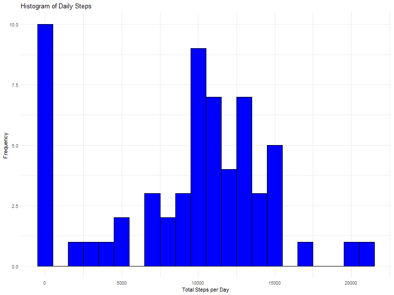
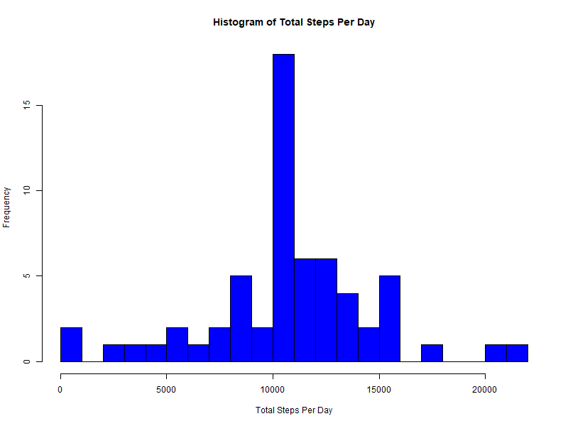
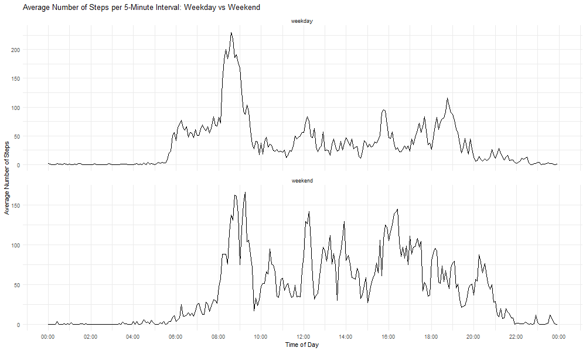

## Loading and preprocessing the data

Libraries needed: dplyr, ggplot2 and lubridate. The first is for data manipulation, the second for plotting and the latter for the date handling. The code will open the libraries itself.

The following code will download the data in the working directory, unzip the data and read the csv. The last line will make sure that the date column is in the right format.


```r
# Load necessary libraries
  library(dplyr)  # For data manipulation
  library(ggplot2) # For plotting
  library(lubridate)  # For better date handling


# Set the URL for the file
  url <- "https://d396qusza40orc.cloudfront.net/repdata%2Fdata%2Factivity.zip"

# Download the file to your working directory
  download.file(url, destfile = "data.zip")

# Unzip or read the file as needed
  unzip("data.zip", exdir = "data")

# Read the CSV file
  data <- read.csv("data/activity.csv")

# Convert the 'date' column to Date type
  data$date <- as.Date(data$date)
```
  


## What is mean total number of steps taken per day?

To answer this question we need to aggregate the steps by date and then we can calculate the mean and median steps per day.


```r
# Aggregate the steps by date
daily_steps <- data %>%
  group_by(date) %>%
  summarise(total_steps = sum(steps, na.rm = TRUE))

# Calculate mean and median of total steps per day
mean_steps <- mean(daily_steps$total_steps, na.rm = TRUE)
median_steps <- median(daily_steps$total_steps, na.rm = TRUE)
```

The results are the following:


```
## Mean total number of steps per day: 9354.23
```

```
## Median total number of steps per day: 10395
```

## What is the average daily activity pattern?

The following code will generate our histogram.


```r
# Plot the histogram of total steps per day
ggplot(daily_steps, aes(x = total_steps)) +
  geom_histogram(binwidth = 1000, fill = "blue", color = "black") +
  labs(title = "Histogram of Daily Steps",
       x = "Total Steps per Day",
       y = "Frequency") +
  theme_minimal()
```


Since we did not remouve the NAs we have an anomalous concentration of points in the first part of the histogram. However we can see that the distribution of steps follow a normal distribution.


```r
# Calculate the average number of steps for each 5-minute interval across all days
average_steps <- data %>%
  group_by(interval) %>%
  summarise(average_steps = mean(steps, na.rm = TRUE))  # Exclude NAs
```

```
## `summarise()` ungrouping output (override with `.groups` argument)
```

```r
# Convert the interval to a time of day format
average_steps$time <- sprintf("%04d", as.numeric(average_steps$interval))
average_steps$time <- as.POSIXct(average_steps$time, format="%H%M", tz="UTC")

# Create the time series plot
plot(average_steps$time, average_steps$average_steps, 
     type = "l",  # Line plot
     xlab = "Time of Day", 
     ylab = "Average Number of Steps", 
     main = "Average Number of Steps per 5-Minute Interval",
     xaxt = "n")  # Suppress default x-axis labels

# Add custom x-axis labels to show time of day
axis(1, at = seq(min(average_steps$time), max(average_steps$time), by = "1 hour"), 
     labels = format(seq(min(average_steps$time), max(average_steps$time), by = "1 hour"), "%H:%M"))
```


From the above graph we can see that in the morning tbere is more activity. And in fact using the below code we can see that:


```r
# Find the interval with the maximum average steps
max_interval_row <- average_steps %>%
  filter(average_steps == max(average_steps))

# Extract the interval number
max_interval <- max_interval_row$interval

# Convert the interval to time format (HH:MM)
hours <- floor(max_interval / 100)
minutes <- max_interval %% 100

# Format the time as HH:MM
max_time_of_day <- sprintf("%02d:%02d", hours, minutes)

# Print the interval and corresponding time of day
cat("The 5-minute interval with the maximum average number of steps is:", max_interval, "\n")
```

```
## The 5-minute interval with the maximum average number of steps is: 835
```

```r
cat("This interval corresponds to the time of day:", max_time_of_day, "\n")
```

```
## This interval corresponds to the time of day: 08:35
```


## Imputing missing values

The following code analyses the total missing values in the dataset:


```r
# Calculate the total number of missing values (NAs) in the dataset
total_missing_values <- sum(is.na(data))

# Print the total number of missing values
cat("Total number of missing values in the dataset:", total_missing_values, "\n")
```

```
## Total number of missing values in the dataset: 2304
```

To deal with NAs I chose to fill missing values with the average for that interval.

In order to do not modify the original data we duplicate the dataset.


```r
# Duplicate the dataset
data_filled <- data

# Calculate the average number of steps for each 5-minute interval across all days
interval_avg <- data %>%
  group_by(interval) %>%
  summarise(avg_steps = mean(steps, na.rm = TRUE))  # Calculate average excluding NAs
```

```
## `summarise()` ungrouping output (override with `.groups` argument)
```

```r
# Fill NAs in the duplicated dataset with the interval averages
data_filled <- data_filled %>%
  left_join(interval_avg, by = "interval") %>%  # Join the average steps by interval
  mutate(steps = ifelse(is.na(steps), avg_steps, steps)) %>%  # Replace NAs with interval average
  select(-avg_steps)  # Remove the temporary avg_steps column

# Check if the NAs are filled
sum(is.na(data_filled$steps))  # This should return 0 if all NAs were filled
```

```
## [1] 0
```

```r
# Calculate the total number of steps taken per day
total_steps_per_day <- data_filled %>%
  group_by(date) %>%
  summarise(total_steps = sum(steps))
```

```
## `summarise()` ungrouping output (override with `.groups` argument)
```

Although the distribution is still normal we can see that the number of 0-steps-days decreased, while the frequency of the most frequent step days increased.


```r
# Plot the histogram
hist(total_steps_per_day$total_steps, 
     breaks = 20,  # Number of bins
     col = "blue", 
     xlab = "Total Steps Per Day", 
     main = "Histogram of Total Steps Per Day",
     border = "black")
```


The way we dealt with NAs had an influence on our results. In fact we can see that:


```r
# Calculate the total number of steps taken per day
total_steps_per_day <- data_filled %>%
  group_by(date) %>%
  summarise(total_steps = sum(steps))
```

```
## `summarise()` ungrouping output (override with `.groups` argument)
```

```r
# Calculate the mean and median of the total steps per day
mean_total_steps <- mean(total_steps_per_day$total_steps)
median_total_steps <- median(total_steps_per_day$total_steps)

# Report the results
cat("Mean total number of steps per day, after filling NAs:", mean_total_steps, "\n")
```

```
## Mean total number of steps per day, after filling NAs: 10766.19
```

```r
cat("Median total number of steps per day, after filling NAs:", median_total_steps, "\n")
```

```
## Median total number of steps per day, after filling NAs: 10766.19
```

## Are there differences in activity patterns between weekdays and weekends?

From the below graph we can see that during weekdays, more steps during the morning where recorded, while during weekends the steps where more evenly distributed during the day.


```r
# Set locale to English
Sys.setlocale("LC_TIME", "C")
```

```
## [1] "C"
```

```r
# Create the 'day_type' variable using English day names
data <- data %>%
  mutate(day_of_week = weekdays(date),  # Get the day of the week in English
         day_type = ifelse(day_of_week %in% c("Saturday", "Sunday"), 
                            "weekend", "weekday"))
# Ensure 'day_type' is a factor with levels "weekday" and "weekend"
data$day_type <- factor(data$day_type, levels = c("weekday", "weekend"))

# Fill NAs in the dataset with the interval averages
interval_avg <- data %>%
  group_by(interval) %>%
  summarise(avg_steps = mean(steps, na.rm = TRUE))
```

```
## `summarise()` ungrouping output (override with `.groups` argument)
```

```r
data_filled <- data %>%
  left_join(interval_avg, by = "interval") %>%
  mutate(steps = ifelse(is.na(steps), avg_steps, steps)) %>%
  select(-avg_steps)

# Calculate the average number of steps for each 5-minute interval by day_type
average_steps <- data_filled %>%
  group_by(interval, day_type) %>%
  summarise(average_steps = mean(steps, na.rm = TRUE))
```

```
## `summarise()` regrouping output by 'interval' (override with `.groups` argument)
```

```r
# Convert the interval to a time of day format for better x-axis labeling
average_steps$time <- sprintf("%04d", as.numeric(average_steps$interval))
average_steps$time <- as.POSIXct(average_steps$time, format="%H%M", tz="UTC")

ggplot(average_steps, aes(x = time, y = average_steps, group = 1)) +
  geom_line() +
  facet_wrap(~ day_type, ncol = 1, scales = "free_y") +  # Separate panels for weekday and weekend
  labs(x = "Time of Day", y = "Average Number of Steps",
       title = "Average Number of Steps per 5-Minute Interval: Weekday vs Weekend") +
  scale_x_datetime(date_labels = "%H:%M", date_breaks = "2 hours") +
  theme_minimal()
```


